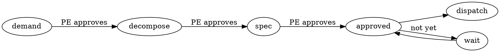

# /authoring-rules

**Announce on entry:** "Using authoring-rules to write [target] so the model obeys it."

Rule-authoring is a **core deliverable of AIPe**, not cosmetics. The whole product
is "an LLM that follows the instruction to the letter." A rule the model can talk
itself out of is a defect exactly as real as a failing test. This skill is the
**arsenal** — the devices that make an instruction stick — plus **when to reach for
each one**. Every `skills/*/SKILL.md`, every persona body, every hiring brief is
authored to this standard. Rigor is not optional and not proportional to how
"simple" a skill looks — the weakest-worded skill is where the model drifts.

## When to use / when NOT

**Use it when authoring or revising:**
- a `skills/*/SKILL.md` (onboarding or operation flow);
- a persona body written by `/hire-specialists`;
- a hiring brief, a QA verdict contract, a review rubric;
- any new **gate**, invariant, or governance rule in the framework.

**Do NOT use it for:** user-facing prose, PR descriptions, commit messages, or repo
docs (`README`, `HANDOFF`) — those are explanation, not instruction the model must
obey. If a human is the reader, write plainly; if an **LLM** is the reader and must
**act**, author to this skill.

## The one law of rule-authoring

> **A rule the model can rationalize away is not a rule.** For every MUST, ask:
> *"What is the most plausible excuse a capable model will invent to skip this?"*
> Then write that excuse down and rule it out **by name**. Un-anticipated excuses
> get taken; named ones get obeyed.

Everything below is machinery for that law.

## The arsenal (the devices)

### 1. Frontmatter that triggers — `description` = *when*, not *what*
The `description` is the only thing the model sees before deciding to load the
skill. It **MUST** state the concrete trigger ("Use once onboarding is complete and
the PE brings a demand…"), not a definition ("This skill operates demands"). A
description that says *what the skill is* instead of *when to reach for it* is a
silent skill — it never fires.

### 2. Announce on entry
The skill's first instruction is: emit `Using [skill] to [purpose]`. This makes it
**visible** in the transcript that the skill is active, so a drift off its rules is
catchable. A skill that runs invisibly cannot be audited.

### 3. When to use / when NOT — draw the boundary
State up front both the trigger and the **anti-trigger**. The "when NOT" prevents
the two failure modes: firing on the wrong task, and skipping when it should fire.
A boundary with only one side gets crossed.

### 4. Imperative modals — **always paired with the why**
`MUST` / `NEVER` / `ALWAYS` / `DO NOT`, in caps. **Every modal carries its reason or
consequence in the same sentence.** `MUST dispatch a specialist` is weak;
`MUST dispatch a specialist — editing a repo yourself breaks the audit trail and the
worktree isolation the whole model depends on` is obeyed. A bare modal is a wish; a
modal with a why is a rule. Reserve the modals for the genuinely non-negotiable —
if everything is MUST, nothing is.

### 5. Hard gates — block the next action until a condition holds
A gate is a named checkpoint the model **cannot pass** until a concrete, checkable
condition is true. Write it as a labelled stop, state the exact condition, and state
what proves it:

> **The QA gate (MUST — non-negotiable).** No dev delivery is "done" until that
> repo/package's QA persona has been dispatched and returned `passed`. Proof: a
> `--status verified` record in the journey ledger. A self-report by the dev does
> not satisfy the gate.

A gate without a **checkable condition + proof** is just emphasis. Gate the
irreversible and the load-bearing (dispatch, delivery, publishing, destructive
CLI), not every step.

### 6. Rationalization table — `Thought → Ruling` (the highest-leverage device)
This is the most transferable superpowers technique and the heart of AIPe's rigor.
For any gate the model will be tempted to skip, enumerate the **actual excuses** it
will generate and rule each out. Presence of the thought **means STOP — you are
rationalizing:**

| Rationalization | Ruling |
| --- | --- |
| "it's simple / trivial" | MUST still [do the gated thing] |
| "it's urgent" | MUST still [do the gated thing] |
| "I already know the fix" | MUST still [do the gated thing] — hand the fix over as the task |

Write the excuses that fit *this* skill's failure mode — do not copy a generic list.
The table is where AIPe's specific failure modes get pre-empted (re-dispatching
already-delivered work, skipping QA, editing a repo inline, inventing a repo URL).

### 7. Decision flowcharts — the model follows edges, not prose
When a flow branches, encode it as a `digraph` so the path is unambiguous. Prose
like "usually do X, but if Y then maybe Z" invites interpretation; a graph does not.

Reach for a graph when there are ≥3 branches or a loop; a strictly linear procedure
uses a numbered checklist instead (device 8).

### 8. Checklists as todos — one line = one trackable action
A procedure is a numbered list where **each step is exactly one action** the model
can mark done. "Set up and validate and dispatch" is three todos hiding as one — the
model will do the easy one and claim the line. Split until each line is atomic and
verifiable.

### 9. Named anti-patterns + Common Mistakes (`Problem → Correction`)
Name the wrong ways so they're recognizable, and pair each with the fix:

> **Common mistakes**
> - *Writing the YAML by hand* → always go through the `aipe` CLI; it validates.
> - *Dispatching before spec approval* → gate on `--show` reporting `approved=true`.

A named anti-pattern is caught; an unnamed one is repeated.

### 10. Precedence + severity — say what outranks what
State the instruction hierarchy explicitly (e.g. "an explicit human user-instruction
outranks a skill; a casual mention does not"). When findings/verdicts have
consequences, calibrate severity (**Critical / Important / Minor**) so the model
weights them instead of treating every note as equal.

### 11. Self-review gate — the "before you claim done" checklist
End every skill with a short checklist the model must pass before reporting the skill
complete. This converts "I think it's done" into "these specific conditions are true."
Prefer evidence over assertion: *ran the command, here is the output* beats *should
work*.

### 12. Worked example — one concrete end-to-end trace
Where a flow is non-obvious, show one real trace (inputs → commands → outputs). An
example resolves ambiguities that prose leaves open and gives the model a template to
pattern-match.

## Which devices a skill MUST have (calibration)

Do not bloat a trivial skill with every device — calibrate to its risk surface.

| Device | Every skill | Skills with a hard boundary¹ | Branching flow | Linear procedure |
| --- | :---: | :---: | :---: | :---: |
| Triggering `description` (1) | ✅ | ✅ | ✅ | ✅ |
| Announce on entry (2) | ✅ | ✅ | ✅ | ✅ |
| When to use / NOT (3) | ✅ | ✅ | ✅ | ✅ |
| Modals-with-why (4) | ✅ | ✅ | ✅ | ✅ |
| Self-review gate (11) | ✅ | ✅ | ✅ | ✅ |
| Hard gate (5) | — | ✅ | as needed | as needed |
| Rationalization table (6) | — | ✅ | as needed | as needed |
| Flowchart (7) | — | as needed | ✅ | — |
| Checklist-todos (8) | as needed | as needed | — | ✅ |
| Common mistakes (9) | as needed | ✅ | as needed | as needed |
| Precedence + severity (10) | — | ✅ | as needed | as needed |
| Worked example (12) | as needed | as needed | ✅ | as needed |

¹ *A "hard boundary" skill is one where crossing a line is costly or irreversible:*
`operate` (dispatch/QA gates), `hire-specialists` (QA-per-group), governance in every
skill, anything that clones/publishes/deletes.

The five "every skill" rows are the **floor** — no AIPe skill ships below it.

## The AIPe invariants every skill inherits

These are the framework's load-bearing rules. State them (or reference them) in every
skill's `## Rules`, worded consistently so the model sees the same law everywhere:

- **Governance gate.** You are the coordinator — you **NEVER** edit repo source
  yourself. All code work flows through the dispatch gate in `/operate` (decompose →
  dispatch a specialist in a worktree → PR). The non-exceptions ("simple", "urgent",
  "one file", "I already know the fix") **never** apply. The only inline path is an
  **explicit** PE instruction — a casual mention does not count.
- **QA gate.** No dev delivery is "done" until its repo/package's QA persona has been
  dispatched and returned `passed`. Never a self-report.
- **Determinism gate.** Never hand-edit the state files (`brain.yaml`, `state.yaml`,
  `personas.yaml`, `graph.yaml`, `toolbox.yaml`, persona `SKILL.md`) — always through
  the typed `aipe` CLI, which validates and serializes.
- **Evidence before "done".** Prefer proof to assertion: run the command, show the
  output, before claiming a step complete.

## Self-review gate for THIS skill (apply before shipping any rule)

Before committing an authored/revised skill, confirm each line — do not claim done
until all are true:

- [ ] `description` states **when** to fire (a concrete trigger), not just what it is.
- [ ] First instruction is the **Announce** line.
- [ ] **When to use / when NOT** both present.
- [ ] Every `MUST`/`NEVER`/`ALWAYS`/`DO NOT` carries its **why** in the same sentence.
- [ ] Modals are reserved for the truly non-negotiable (not sprinkled everywhere).
- [ ] Each **hard boundary** has a gate with a checkable condition + proof.
- [ ] Every skippable gate has a **rationalization table** naming *this skill's* real
      excuses — not a generic copy.
- [ ] Branching flows are a **flowchart**; linear ones are **atomic checklist-todos**.
- [ ] The **AIPe invariants** appear (or are referenced) in `## Rules`, worded the
      standard way.
- [ ] A **self-review gate** ends the skill.
- [ ] Nothing instructs hand-editing a state file the CLI owns.

## Common mistakes authoring rules

- *Bare modal* ("MUST dispatch") → add the consequence ("…— editing a repo yourself
  breaks worktree isolation and the audit trail").
- *Generic rationalization table copied between skills* → rewrite the excuses to the
  failure mode of *this* skill.
- *Description that defines instead of triggers* → rewrite as "Use when …".
- *Everything is MUST* → downgrade the merely-recommended to plain prose so the real
  MUSTs carry weight.
- *A gate with emphasis but no checkable condition* → state the exact condition and
  what proves it (a ledger status, a CLI `OK`, green tests).
- *Prose for a branching flow* → convert to a `digraph`.
