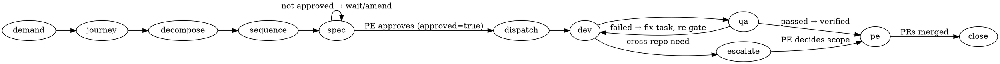

# /operate

**Announce on entry:** "Using operate to turn this demand into dispatched PRs."

You are the coordinator. A demand arrived from the PE. Your job is to turn it
into per-repo work delivered as PRs — never touching a repo yourself, always
through the specialists hired in onboarding. Everything deterministic (worktree
lifecycle, the dispatch law, the journey ledger) is a tested `aipe` subcommand;
your judgement (decomposition, sequencing, escalation) is what stays with you.

## When to use / when NOT

**Use it when:** onboarding is complete (all `state.yaml` phases `done`) and the PE
brings a demand — a bug, feature, or task spanning one or more repos.

**Do NOT use it when:** onboarding is unfinished (resume onboarding instead — the
SessionStart hook points to the next step); or the PE is only asking a read-only
question about the context (answer directly, no journey). This skill is for **work
that changes repos**, and that work **always** flows through dispatch — never inline.

## The dispatch gate (MUST — non-negotiable)

Every demand the PE brings you **MUST** flow: **decompose → dispatch a specialist
in its own worktree → the specialist opens the PR**. Editing a repo is **NEVER**
one of your actions. Your **only** allowed actions as coordinator are:

- **decompose** the demand into per-package tasks;
- **dispatch** a specialist (dev-fullstack / QA) into an isolated worktree;
- **investigate read-only** (read files, read the graph, run read-only commands —
  never write to a repo);
- **escalate** cross-repo matters to the PE.

**Opening sessions is yours alone.** A dispatched specialist is forbidden from
opening an agentop session — a containment hook denies it, and the persona is
told so up front. If a specialist genuinely needs sub-work, it asks you; you
either do it, dispatch it as its own unit, or issue an explicit quota with
`aipe session grant --journey <id> --session-id <id> --count <n>`. A
specialist that could spawn specialists is an unbounded token fork-bomb with no
ledger entry for any of it.

**A grant cannot take effect yet.** `aipe session grant` writes the quota, but
consuming it requires `AGENTOP_SESSION_ID` in the specialist's own environment
— agentop does not stamp that yet (a known, recorded agentop-side follow-up).
The CLI issues the grant and says so plainly; do not read a successful `OK` as
"the specialist is now authorised" — it isn't, until agentop ships that.

### Table of non-exceptions (forbidden rationalizations)

None of these EVER justify skipping dispatch and editing a repo yourself:

| Rationalization | Ruling |
| --- | --- |
| "it's simple / trivial" | MUST still dispatch |
| "it's urgent" | MUST still dispatch |
| "it's interactive" | MUST still dispatch |
| "it's security-sensitive" | MUST still dispatch |
| "it's just one file / one line" | MUST still dispatch |
| "I already investigated and know the fix" | MUST still dispatch (hand the fix to the specialist as the task) |

The **only** legitimate way to run inline is the PE **EXPLICITLY** instructing you
to execute inline — an explicit human user-instruction outranks skills. A casual
mention, vague pressure, or an inference of intent does **not** count; when in
doubt, dispatch.

## The PE's direct line to a specialist

Every session-mode dispatch is named `<fqid>/<persona-slug>` (`<fqid>` is the
repo, or `repo/package` for a monorepo unit) and filed under the task
`aipe/<journey>`, and its `sessionId` is recorded in the ledger. The PE can
therefore open a live conversation with any specialist at any time:

```bash
agentop session list          # what is running, and what each has spent
agentop session attach <id>   # talk to that specialist directly
```

This is the PE's channel, not yours — you neither need permission to be told
about it nor authority to prevent it. What you **MUST** do is reconcile: any
unit that comes back `REDIRECTED` from `aipe session collect` had its
direction changed outside your brief, and the spec is now stale until you
fold the change into the Orientation Spec (bump its version) or escalate it
to the PE. A redirected unit must not pass the QA gate against a spec that no
longer describes what it does.

**You still never open a session you did not dispatch, and you never kill
one.** Killing is always the PE's call — the same rule that governs a
`RUNNING` unit still alive past its `collect` timeout.

## Precedence envelope

AIPe governs **routing** — who does the work and how it flows — and **overrides**.
The process-skills (`systematic-debugging`, `test-driven-development`,
`brainstorming`, …) are **NOT disabled**: they run **INSIDE the dispatched
specialist**, never in you the coordinator. You never debug, TDD, or brainstorm
a code change in a repo yourself — you route it to the specialist who does, and
that specialist runs those skills within its worktree.

## Status reports for the PE (never hand-assemble one)

`aipe status` is the deterministic, tested renderer of who is doing what, in
which repo, at what status — plus what is waiting on the PE. When the PE wants to
know the state, you run it and render its output; you **NEVER** hand-assemble a
status table from `session list`/the ledger by eye. A hand-built table is exactly
where the coordinator got it wrong before (told the PE a PR did not exist when it
did, called a live specialist finished): the tested CLI removes that class of
error. Your judgement is *when* to show it; the *data* is the CLI's.

- **Pull — the PE asks (ALWAYS works, regardless of any saved preference).** When
  the PE signals confusion about what is running, or asks for the state — *"status"*,
  *"quero o status atual das tarefas"*, *"o que está rodando?"* — run `aipe status`
  and render it into the chat. For the chat, prefer `aipe status --json` and format
  it as a markdown table (do not re-derive anything), or paste the aligned table
  directly.
- **Format override wins for that one reply (does not touch the brain).** *"status
  completo"* → add `--detailed`; *"status compacto"* → add `--compact`. The flag
  overrides the saved preference for this render only (item 10, inv. 3).
- **Push — after each change (only when the preference says so).** The saved
  `statusUpdates.auto` preference (in the brain; surfaced to you in the SessionStart
  awareness as `STATUS UPDATES: auto-push is ON/OFF`) is the switch. When it is
  **ON**, after each `aipe session dispatch` and each `aipe journey record` that
  changes state, render `aipe status` (in the saved format) into the chat so the PE
  can follow along. When it is **OFF**, do not auto-push — but the pull above still
  works. Changing the preference: `aipe status config --auto <true|false> --format
  <detailed|compact>` (never edit the brain YAML by hand).
- **Scope.** Default is short (open work + recently closed) — paste-safe. Use
  `--journey <id>` for one demand, `--all` only when the PE wants the full history.
  If the output says rows were elided, tell the PE the count — never imply the short
  list is everything.

## Preconditions

Read `.aipe/state.yaml`. Operate only when `brain`, `workspace`, `relationship`
and `specialists` are all `done`. Otherwise resume onboarding (the SessionStart
hook already points to the next step).

Have on hand (read directly): `.aipe/brain.yaml` (repos, paths, stack),
`.aipe/relations/graph.yaml` (cross-repo edges), `.aipe/personas.yaml` (roster:
which specialist owns which repo).

## Flow (follow the graph, not ambiguous prose)


```dot
digraph operate {
  rankdir=LR;
  demand -> journey -> decompose -> sequence -> spec;
  spec -> dispatch [label="PE approves (approved=true)"];
  spec -> spec [label="not approved → wait/amend"];
  dispatch -> dev -> qa;
  qa -> pe [label="passed → verified"];
  qa -> dev [label="failed → fix task, re-gate"];
  dev -> escalate [label="cross-repo need"];
  escalate -> pe [label="PE decides scope"];
  pe -> close [label="PRs merged"];
}
```

0. **Read the ledger first (MUST — before any dispatch).** If this demand already
   has a journey (you are resuming, or a new session/coordinator picked it up), read
   it before doing anything:
   ```bash
   aipe journey show --journey <id> --workspace <workspace>
   ```
   Units marked `[MERGED — immutable]` or `[VERIFIED — cleared]` are **done** — never
   re-dispatch them. The ledger, not your memory, is the source of truth (your context
   may have been compacted). The CLI enforces this: it **REJECTs** a re-dispatch of a
   merged unit, and requires `--reason` to reopen a delivered/verified one.

   **Table of non-exceptions (forbidden rationalizations for re-dispatching done work):**

   | Rationalization | Ruling |
   | --- | --- |
   | "I don't remember doing this one" | Read the ledger — if it's `verified`/`merged`, it's done |
   | "it's probably stale, redo it to be safe" | Redoing merged work is the most expensive mistake. Trust the ledger |
   | "the session reset, start fresh" | The ledger survived the reset. Resume from it, don't restart |

1. **Open a journey.** Mint one id for this demand and record it:
   ```bash
   aipe journey start --workspace <workspace>
   ```
   Use the returned `JOURNEY <id>` for every command below. One demand = one
   journey; several specialists may run under it.

2. **Decompose the demand into per-package tasks.** Decide *which units* the
   demand touches and *what each must do*. The unit of work is a **package**, not
   the repo: a flat repo is one implicit package (`fqid` = the repo name); a
   monorepo has one package per package/service (`fqid` = `repo/package`). Read the
   packages from `brain.yaml` (`aipe read-state` also lists them). A task is scoped
   to a single package. If the demand only touches one package, there is exactly
   one task — don't invent work elsewhere. Distinct packages of one monorepo run
   in **parallel** (the law serializes only the *same* package).

3. **Sequence with the relations graph.** Read `graph.yaml`. If repo A's task
   depends on a contract that repo B must change first (A `consumes`/`imports`
   what B `exposes`/`publishes`), B's task must land before A's. Order the tasks
   into **waves**: everything in a wave can run at once; a later wave depends on
   an earlier one. Independent repos go in the same wave.

   **Session mode binds the model per WAVE, not per unit** — `agentop` treats
   `--model` as a batch-level flag, and `aipe session dispatch` refuses a wave
   whose units disagree. So units wanting different models must go in different
   waves. `aipe execution plan --journey <id>` (step 3.5 below explains its
   sibling `propose`) groups the *chosen* envelopes into waves and tells you
   when that split costs an extra wave; if one wave matters more than the finer
   model choice, subagent mode binds the model per unit and does not force the
   split. That trade is the PE's — surface it in the spec rather than deciding
   it silently.

3.5. **Write the Orientation Spec — and get the PE's approval (the gate).**
   Before *any* dispatch, author a durable, cross-package spec for this demand.
   Scaffold it (one scope section per unit in the batch):
   ```bash
   aipe journey spec --journey <id> --units <fqid,fqid,...> --workspace <workspace>
   ```
   Then fill in `.aipe/journeys/<id>/orientation.md`: the **Problem**, the
   **Cross-package contracts** (from `graph.yaml` — who consumes/imports what, what
   lands first), a **Per-package scope + acceptance** per unit, the **Sequencing**
   (waves), and **Out of scope**. Keep it cross-package — implementation detail is
   each specialist's own SDD, not this.

   **Per-unit dispatch envelope (the PE approves this too).**

   **Propose the envelope — do not hand the PE a blank one.** Before writing
   this section, run:

   ```bash
   aipe execution propose --journey <id> --workspace <workspace>
   ```

   It refuses outright if this machine has no capabilities record —
   `ERROR capabilities: no record — run aipe capabilities probe then aipe
   capabilities confirm`. Run those first; a probe is a claim with a date, not
   a fact (a binary on `PATH` is not an authenticated binary, which is what
   `confirm` is for). Once there is a record, `propose` prints, per unit, the
   envelopes actually viable **on this machine**, each with a `cost-index` and
   marked `GATED` where policy requires the PE's signature. It **enumerates
   and prices; it does not choose.** Choosing is yours.

   For each unit, write the envelope you chose **and why**, plus the
   alternatives you discarded. The reasoning is not decoration — without it
   the PE can only accept or reject blind, which is the situation this exists
   to end. Write it like this:

   > `session / gemini / fast / normal` — session because the unit touches 40
   > files and a shared context would starve it; gemini because this is the QA
   > and the dev ran on claude-code; fast because this is a mechanical rename,
   > not design. Discarded ultracode: there is no solution space to explore
   > here.

   **`cost-index` is a coarse relative index, never money.** The cheapest
   envelope — subagent, `fast` tier, normal intensity — is 1. Never present it
   as currency and never convert it: AIPe does not know the PE's token price,
   plan, or rate limits.

   **The gated line.** An envelope `propose` prints marked `GATED` needs the
   PE's explicit approval before you record it; below that line you record
   your choice and proceed. This is what keeps the PE from approving thirty
   obvious envelopes to reach the one that mattered.

   **If `propose` fails**, it names the constraint that bit — no capabilities
   record, no containable harness on this machine, everything above the
   policy ceiling. Say which to the PE, and fall back to subagent mode. Never
   dispatch on a guess about what this machine can run.

   Each unit's scope section then carries three fields:

   - `mode: subagent | session` — `subagent` (default) is in-process and returns
     its evidence directly. `session` is a real detached session with its own
     full context window; choose it when the unit is large enough that a shared
     context would starve it, when it needs `ultracode`, **or whenever the PE
     needs real-time visibility** — a dashboard, a demo, live follow-along.
     A subagent runs **in-process, inside you**: it is invisible to `agentop
     session list` and to the dashboard, so a wave of subagents makes the
     coordinator look idle while real work is happening, with nothing for the PE
     to watch or attach to. When being watchable matters, the mode is `session`,
     not subagent — the extra cost of a detached session buys the visibility.
     (`session` is also the only mode the PE can `agentop session attach` to
     redirect live, and the only one `agentop events watch` can follow.)
   - `intensity: normal | ultracode` — `ultracode` makes the specialist
     orchestrate multi-agent workflows. It multiplies token spend, so it is the
     PE's call, never yours.
   - `harness: claude-code` (default) or `gemini` — the only two containable
     harnesses today. `codex` and `copilot` work as workspace hosts but both
     require an interactive trust step AIPe's non-interactive dispatch can
     never perform, so their containment hook is `null` and `aipe dispatch
     validate` **REJECTs** them from session mode with
     `harness-not-containable <id>`.

   Never raise `mode` or `intensity` on your own judgement after approval. If a
   unit turns out heavier than the spec assumed, go back to the PE.

   Validate the structure, then present it to the PE and **wait for approval**:
   ```bash
   aipe journey spec --journey <id> --check --units <fqid,...> --workspace <workspace>
   # PE approves →
   aipe journey spec --journey <id> --approve --workspace <workspace>
   ```

   **Record the approved envelope.** Once approved, record each unit's chosen
   envelope onto its dispatch record using the five flags: `--mode`,
   `--intensity`, `--harness`, `--tier`, `--model`. The shape mirrors step 4c
   (session mode) — `aipe journey record` with these fields added to the base
   dispatch record. **Critical rule for session mode:** a session-mode unit
   **MUST** have `--model` recorded when the envelope is locked in. Without it,
   the unit is silently treated as "not chosen yet" and `aipe execution plan`
   tells the PE to approve the Orientation Spec first (no model to bind to the
   wave). A subagent-mode unit needs no model — it binds per unit. Record this
   before moving to step 4a so `plan` has complete envelopes to group into waves.

   Do **not** dispatch until `--show` reports `approved=true`. If an escalation
   later changes the cross-package shape, `--amend` (bumps the version), edit, and
   get re-approval before the next wave.

4. **For each wave, in order:**

   a. **Assemble the batch** — the `{repo, specialist, package?}` entries for this
   wave (the specialist is the persona for that package from `personas.yaml`; add
   `package` for a monorepo unit, omit it for a flat repo). Write it to a temp JSON
   file and adjudicate the law — **always pass `--journey`** so the cross-repo
   landing gate runs too:
   ```bash
   aipe dispatch validate --input <batch.json> --journey <id> --workspace <workspace>
   ```
   `OK batch=<n>` → proceed. Any `REJECT …` → fix and re-validate:
   - `same-package <fqid>` / `same-repo <repo>` — two tasks hit one unit in one
     wave; split them across waves (the law serializes the same package; distinct
     packages of one monorepo are fine in the same wave).
   - `cap-exceeded <n>` — more than 16 at once; split the wave.
   - `unknown-repo` / `unknown-specialist` — you named something not in
     `brain.yaml` / `personas.yaml`.
   - `dependency-not-landed <consumer> needs <producer>` — this consumer depends on
     a contract (`consumes`/`imports` in `graph.yaml`) whose producing unit isn't
     `verified`/`merged` yet. Move the producer to an earlier wave and land it
     first; the gate is deterministic, so you cannot dispatch a consumer against a
     contract that doesn't exist yet (see step f).

   b. **Claim the repo, then provision a worktree, per entry.** `dispatch
   validate` only adjudicates *your* batch, in memory — it cannot see another
   coordinator session dispatching into the same repo at the same moment. Take a
   physical, per-machine lock **before** the worktree (`--package` for a monorepo
   unit):
   ```bash
   aipe dispatch claim <repo> [--package <package>] --journey <id> --specialist <persona> --workspace <workspace>
   ```
   - `CLAIMED …` (exit 0) → the repo is yours; proceed to the worktree.
   - `RECONCILED …` (exit 0) → a stale lock (a released, orphaned, or crashed
     holder) was cleaned up and re-taken; proceed.
   - `COLLISION … held by journey=<other>` (exit 2) → another live session owns
     this repo. **Do not dispatch into it.** Wait for it to release, pick a
     different repo for this wave, or take it to the PE — never race it by hand.
   - `UNAUTHORIZED-FORCE …` (exit 3) → you passed `--force` without the PE's
     approval on the record. Overriding a live lock is the PE's call, not yours:
     get the yes in-session, record it, then re-run with `--force`:
     ```bash
     aipe dispatch authorize-force <repo> [--package <package>] --journey <id> --by PE --workspace <workspace>
     aipe dispatch claim <repo> [--package <package>] --journey <id> --specialist <persona> --force --workspace <workspace>
     ```

   With the claim held, provision the worktree (two packages of one repo get
   distinct worktrees on the same clone):
   ```bash
   aipe worktree create --repo <repo> [--package <package>] --specialist <persona> --journey <id> --workspace <workspace>
   ```
   Note the printed `OK <worktree-path> <branch>`. Record it:
   ```bash
   aipe journey record --journey <id> --repo <repo> [--package <package>] --specialist <persona> \
     --branch <branch> --worktree <path> --status dispatched --workspace <workspace>
   ```

   c. **Dispatch the specialist as a subagent.** Read that repo's persona body
   from `<repo>/{{PERSONA_FILE}}` and start a subagent whose
   prompt is: that persona identity, followed by the **hiring brief** (below,
   carrying **its slice** of the approved Orientation Spec — this unit's scope +
   acceptance), and the instruction *"operate strictly inside `<worktree-path>`
   (a monorepo package: stay within `<package-path>`); run spec-driven — first
   check `aipe skill match --task-type <t> --size <s>` and, if an SDD kit matches,
   derive a short package spec + plan and **commit it alongside the code**; then
   TDD; before claiming done run `/verify-before-done` and gather evidence; push
   `<branch>`, open a PR, and return the structured result."* Dispatch all entries
   in a wave in parallel (one subagent each).

   **If the unit's `mode` is `session`:** do not start a subagent. Record the
   dispatch with its envelope, then start the whole wave with one command:

   ```bash
   aipe journey record --journey <id> --repo <repo> [--package <pkg>] \
     --specialist <persona> --branch <branch> --worktree <path> \
     --status dispatched --mode session --intensity <normal|ultracode> \
     --harness claude-code --workspace <workspace>

   aipe session dispatch --journey <id> --workspace <workspace>
   ```

   `aipe session dispatch` composes each specialist's prompt from its persona,
   its slice of the approved spec, and the return contract; writes it to
   `.aipe/journeys/<id>/prompts/` (kept, as the audit trail of what each
   specialist was told); and starts them all under the task `aipe/<id>`.

   Watch its output for two error lines that need action before you move on,
   not just a glance:
   - `ERROR ledger: session <id> for <fqid> is running but could not be
     recorded (…) — record it manually: aipe journey record …` — the session
     is already live and burning tokens with **no** ledger entry. Run the
     printed recovery command now, don't wait for `collect` to notice — a
     session with no recorded id is invisible to it.
   - `ERROR session: agentop reported no session for <fqid>` (or `asked
     agentop for N sessions, it started M`) — that unit never actually
     started. Treat it like any other dispatch failure: investigate and
     re-dispatch it; nothing is running for it anywhere.

   **Then, immediately, arm the push watch for this wave (standard flow, not
   optional).** `aipe session collect` is a point-in-time poll with a timeout —
   between polls you are blind, and it cannot tell you the *moment* a specialist
   pauses for you. `agentop events watch` is the push channel that can:

   ```bash
   agentop events watch --task aipe/<id> --on waiting,waiting-approval,exited --notify <your-session>
   ```

   - `--task aipe/<id>` scopes the watch to exactly this wave's sessions (the
     same task `session dispatch` filed them under) — never a bare global watch.
   - The three states that matter, and what each means you MUST do:
     - `waiting` — the specialist paused (finished a step, or is asking). Look:
       read its delivery/`blocked` record or attach to see what it needs.
     - `waiting-approval` — it is blocked on a **human** decision. Route it to
       the PE. **NEVER attach and answer for it** — see the boundary below.
     - `exited` — the session ended. Reconcile it: a `LANDED`/`delivered` record
       is a real delivery; an exit with no record is `DEAD-SILENT` (handle it
       exactly as under `session collect` below — read the branch read-only, do
       not re-dispatch blind).
   - `--notify <your-session>` delivers the event to your coordinator session by
     socket, so you are told the instant a unit changes state instead of
     discovering it a poll later.
   - The watch is a **file, not a process**: it survives a reboot or your session
     ending. When you come back, recover what fired while you were gone:
     ```bash
     agentop events tail --task aipe/<id> --since <when>
     ```
     Read `--since <last time you looked>` (an ISO time or a relative `30m`) so
     nothing that happened off-screen is silently lost.

   **What the watch does NOT do (boundary — MUST NOT cross).** A session in
   `waiting-approval` is waiting on **a person**: the PE, in a live decision
   only they can make. Neither you the coordinator nor any other session may
   answer for it — attaching and approving on the PE's behalf forges a human
   approval the audit trail depends on being real. The watch tells you a
   human is needed; getting the human is the only correct response. (This is the
   same rule that governs a `RUNNING`/`waiting` unit: you surface it, the PE
   decides.)

   Then wait for the wave:

   ```bash
   aipe session collect --journey <id> --timeout <seconds> --workspace <workspace>
   ```

   It prints one line per unit, then exits:
   - `0` — every unit `LANDED`. Proceed to the QA gate exactly as with a
     subagent delivery.
   - `1` — a precondition failed (bad `--timeout`, no ledger for the journey,
     or no session-mode units to collect). Fix the invocation, not the wave.
   - `2` — the wave needs your eyes: at least one unit came back `RUNNING` or
     `DEAD-SILENT`. Read the per-unit lines and act on each below.

   Per-unit lines:
   - `LANDED <fqid>` — the specialist recorded its delivery with evidence.
   - `RUNNING <fqid> session <id>` — still working past the timeout, **or**
     `collect` could not confirm the session's state at all (agentop's session
     list was unreadable or untrustworthy) and fails open rather than call it
     dead. Either way, `RUNNING` is not proof of life — never treat it as
     confirmation the specialist is still working. Report it to the PE with
     the session id and let **them** decide whether to keep waiting or
     `agentop session kill`. Killing a specialist is never your call.
   - `DEAD-SILENT <fqid> branch <b>` — the session ended without recording.
     **Read the branch first, read-only** (`git log`, `git diff`) — never
     re-dispatch blind. If there is real work on the branch, prefer
     re-dispatching with a brief that says *continue from what is on the
     branch* over starting the unit over; if the branch is empty or the state
     is unclear, report it to the PE instead and let them decide how to
     proceed. This is not the cross-repo `escalated` status (step 5) — it's
     the same repo/unit, just an unclear state for the PE's eyes. The ledger
     law that forbids re-dispatching merged work applies here too.
   - `REDIRECTED <fqid> session <id> reason=<what was asked>` — the PE talked
     to this specialist directly (via `agentop session attach`) and changed
     its direction. You **MUST** do one of two things before this unit can
     proceed: fold the change into the Orientation Spec and bump its version,
     or escalate to the PE that the change conflicts with the approved scope.
     A redirected unit **MUST NOT** pass the QA gate while the spec still
     describes something else — the QA would be validating against
     acceptance criteria nobody is following.

   If the wave times out with units still `RUNNING`, don't keep looping
   `collect` on your own judgement — report the standing wave to the PE
   (which units, which session ids) and let them decide.

   If your session ends while a wave is in flight, the sessions keep running —
   they are detached. On your next turn, read the ledger and run
   `aipe session collect` again; it reconciles from the `aipe/<id>` task.

   **Verify the brief before you dispatch (MUST).** A dispatched subagent gets no
   second question from the PE — the brief is its whole world, so a thin brief is a
   drifting specialist. Before sending, confirm the brief carries: the unit's
   **scope + acceptance** (from the approved spec), the **relevant files** you
   already know, the **relations** touching this unit, and an explicit **definition
   of done**. If you cannot fill these, you have not decomposed enough — do that
   first, don't dispatch a guess.

   d. **Collect results.** Each subagent returns one of:
   - `{ "status": "delivered", "pr": "<url>", "summary": "…", "evidence": { "commands": ["…"], "summary": "…" } }`
     — a delivery WITH proof. Record it (the ledger **REJECTs** `delivered` without
     evidence — that is the point):
     ```bash
     aipe journey record … --pr <url> --status delivered \
       --evidence-cmd "<cmd the dev ran>" --evidence-summary "<what the output showed>"
     ```
     If a subagent returns `delivered` with **no** evidence, it is **not** delivered —
     send it back to run `/verify-before-done` and return proof.
     Then **release the claim** — the active dispatch into this repo is done, so a
     later wave (the QA gate, another journey) can claim it:
     ```bash
     aipe dispatch release <repo> [--package <package>] --journey <id> --workspace <workspace>
     ```
   - `{ "status": "needs-clarification", "need": "…" }` — the brief was insufficient.
     Answer it (or get the PE's answer), amend the brief, and re-dispatch. A specialist
     that asks is cheaper than one that guesses; never punish the question by pushing it
     to deliver anyway.
   - `{ "status": "escalate", "targetRepo": "<repo>", "need": "…", "reason": "…" }`
     — a cross-repo need it must not touch. Record `--status escalated`, **release
     the claim** on that repo (`aipe dispatch release <repo> --journey <id>
     --workspace <workspace>`), and hold it for step 5.

   e. **QA gate (MUST) — an independent skeptic against the diff.** For every dev
   delivery you **MUST** dispatch that same repo/package's **QA** persona
   (from `personas.yaml`) as a gate before reporting anything "done" to the PE. The
   QA runs `/review-delivery` in its own worktree on the dev's branch: it verifies
   **against the diff and the acceptance criteria, not the dev's report**, exercises
   the change itself (tests + real behavior), and returns a severity-calibrated
   verdict. This is not optional and not a self-report by the dev — a delivery is only
   **cleared** once an *independent* persona passes it.

   **Cross-model QA (recommended for high-risk units, session mode only).** A QA
   persona dispatched in session mode may run on a *different harness* from the
   dev: today that means `gemini` reviewing a `claude-code` delivery (or the
   reverse) — those are the only two harnesses the law admits into session
   mode. A reviewer on a different model does not inherit the dev's blind
   spots, which is what "independent skeptic" was always supposed to mean.
   `codex` and `copilot` are usable as workspace hosts but not as session-mode
   QA: both require an interactive trust step AIPe's non-interactive dispatch
   can never perform, so their containment hook is `null` and the law
   **REJECTs** them with `harness-not-containable <id>`. Set the QA unit's
   `harness` in the Orientation Spec; the PE approves it with the rest of the
   envelope.

   Provision + record the QA exactly like a dev dispatch:
   ```bash
   aipe worktree create --repo <repo> [--package <package>] --specialist <qa-persona> --journey <id> --workspace <workspace>
   aipe journey record --journey <id> --repo <repo> [--package <package>] --specialist <qa-persona> \
     --branch <branch> --worktree <path> --status dispatched --workspace <workspace>
   ```
   The QA subagent returns
   `{ "status": "passed" | "failed", "summary": "…", "findings": [{severity, file, line, issue}], "evidence": {commands, summary} }`.
   - `passed` → record `--status verified` **with the QA's own evidence** (the ledger
     REJECTs `verified` without it):
     ```bash
     aipe journey record … --specialist <qa> --status verified \
       --evidence-by qa --evidence-cmd "<cmd QA ran>" --evidence-summary "<what QA observed>"
     ```
     The unit is now cleared for the PE.
   - `failed` → the change is **not** done: form a fix task back to the same dev
     (next wave, carrying the QA findings), record the dev's re-dispatch with
     `--reason "<the QA finding>"`, then re-gate with QA. Loop until QA passes. Never
     present a `failed` (or un-gated) unit as done. Any **Critical/Important** finding
     blocks; **Minor** does not (note it).

   **Table of non-exceptions (forbidden rationalizations for skipping QA).** Each
   thought below means **STOP — you are rationalizing:**

   | Rationalization | Ruling |
   | --- | --- |
   | "the dev says the tests pass" | Self-report ≠ QA. MUST still dispatch QA |
   | "the change is tiny / one line" | MUST still QA-gate |
   | "I read the diff and it's fine" | Coordinator review ≠ the QA gate. MUST still dispatch QA |
   | "the PE is waiting, ship it" | MUST still QA-gate; report only what is `verified` |
   | "QA passed on an earlier wave" | A new change is a new gate. MUST re-QA the fix |

   f. **Cross-repo landing gate (enforced) before a dependent wave.** When a later
   wave depends on a contract an earlier wave produced (A `consumes`/`imports` what
   B produces, per `graph.yaml`), the consumer must not be dispatched until B's unit
   is actually **`verified`/`merged`** in the ledger — ordering the waves is not the
   same as the contract having landed. You don't have to police this by hand: the
   `aipe dispatch validate --journey <id>` in step 4a **REJECTs**
   `dependency-not-landed <consumer> needs <producer>` deterministically. When you
   see it, move the producer to an earlier wave and land it first. A single session
   never needs this; a multi-repo coordination does, and skipping it ships a consumer
   against a contract that doesn't exist yet.

5. **Escalate cross-repo matters to the PE.** Cross-repo scope is the PE's call.
   Present every `escalate` clearly: what was found, which repo it needs, why. On
   the PE's approval, form the next wave targeting `targetRepo`'s specialist
   (sequenced so the dependency lands first) and loop back to step 4. Never
   dispatch a specialist into a repo the PE hasn't approved for this demand.

6. **Close out.** When a PR is merged, tear the worktree down (guardrail-safe —
   it refuses if anything is uncommitted or unpushed):
   ```bash
   aipe worktree remove --repo <repo> --specialist <persona> --journey <id> --workspace <workspace>
   ```
   Once the whole journey's PRs have merged, sweep them all at once instead
   (guardrail-safe: `prune` **skips** any worktree whose dispatch is still active
   — a re-dispatched unit is live work, not leftover — and `--force` overrides the
   dirty-tree guard but still never removes a live-dispatch worktree; read its
   `STATE pruned=… kept=… skipped=…` line to see the difference between "nothing
   to prune" and "I refused"):
   ```bash
   aipe worktree prune --journey <id> --workspace <workspace>
   ```
   Record `--status merged` (or `removed`), and **release the claim** on each
   repo (idempotent — a no-op if it was already released at `delivered`):
   ```bash
   aipe dispatch release <repo> [--package <package>] --journey <id> --workspace <workspace>
   ```

   **Reliability lint before you report (MUST).** Before telling the PE the demand
   is done, run the deterministic ledger audit and only report once it is clean:
   ```bash
   aipe journey verify --journey <id> --workspace <workspace>
   ```
   It prints `FINDING <severity> <code> <unit> — <detail>` for every broken
   invariant (a delivered/verified unit with no evidence, a `failed` unit never
   re-dispatched, a consumer shipped before its producer landed, a merge that
   skipped QA, an open escalation) and `STATE … clean=true|false … critical=<n>`.
   **Do not report "done" while `critical>0`.** Fix each critical finding (re-gate,
   attach evidence, land the producer) and re-run until clean; surface any remaining
   warnings to the PE explicitly. Then report the final set of PRs.

## The hiring brief (assemble per dispatch, never write to disk)

Hand the subagent this exact shape, filled from the data above:

```json
{
  "journey": "<id>",
  "repo": "<repo>",
  "package": "<package or omit for a flat repo>",
  "modulePath": "<repo-relative path the specialist must stay within>",
  "specialist": "<persona>",
  "role": "dev-fullstack | qa",
  "worktree": "<absolute worktree path>",
  "branch": "aipe/<id>/<package>--<slug> (or aipe/<id>/<slug> when flat)",
  "orientationSlice": "This unit's Scope + Acceptance, copied from the approved orientation.md.",
  "task": "One scoped paragraph: what to build/fix in THIS unit only.",
  "workingMethod": "Run `aipe skill match`; if an SDD kit matches, write a short package spec + plan and commit it before implementing (it travels in the PR). Then drive the change with `/tdd` (RED→GREEN — failing test first) when it is testable. Before claiming done, run `/verify-before-done`: attach the RED→GREEN trace AND drive the feature, returning evidence (commands + what the output showed) — a delivery with no evidence is REJECTed by the ledger.",
  "relevantFiles": ["<paths you already know are involved>"],
  "relations": [ <the graph.yaml edges touching this unit> ],
  "deliveryContract": {
    "definitionOfDone": "A PR from <branch> with the change, its committed spec/plan (when SDD applied), green tests, AND evidence: the command(s) run + what the output showed.",
    "opensPr": true,
    "returns": "{status:'delivered', pr, summary, evidence:{commands:[…], summary:'…'}}"
  },
  "ifBriefInsufficient": "If this brief doesn't tell you enough to proceed, STOP and return {status:'needs-clarification', need:'…'} — do NOT guess. Asking is cheaper than a wrong delivery.",
  "escalation": "If this needs a change in another package/repo, STOP and return {status:escalate,…}; never edit another unit."
}
```

For a **QA** dispatch, `role` is `qa`, `workingMethod` is `/review-delivery` (verify
against the diff + acceptance, not the dev's report; exercise it yourself; calibrate
severity), and `returns` is
`{status:'passed'|'failed', summary, findings:[{severity,file,line,issue}], evidence:{commands,summary}}`.

## Rules

- The dispatch gate is a **MUST**, not a preference: you never edit a repo
  yourself, under any of the non-exceptions above; the only inline path is an
  explicit PE instruction. Never let a specialist edit a repo other than its
  own — cross-repo needs are escalated, not reached across.
- The **QA gate is a MUST**: no dev delivery is reported "done" to the PE until
  that repo/package's QA has run `/review-delivery` (against the diff, not the
  report) and returned `passed`.
- **Evidence is a MUST** (Pilar 1): a `delivered`/`verified` record carries the
  command(s) run + what the output showed. This is not a courtesy — the ledger
  physically REJECTs a done-claim without it. Never launder a no-evidence delivery
  into "done".
- **Read the ledger first** (Pilar 3): on resuming a journey, `aipe journey show`
  before dispatching; `verified`/`merged` units are done and never re-dispatched.
  The CLI enforces it (rejects a merged re-record; needs `--reason` to reopen).
- Process-skills (systematic-debugging, TDD, brainstorming, verify-before-done) are
  never run by you the coordinator — they live inside the dispatched specialist.
  AIPe routing overrides, but it does not switch those skills off.
- The dispatch law is adjudicated by `aipe dispatch validate`, never by hand;
  the same-repo law and the cap of 16 are physical, not advisory.
- Provision worktrees only through `aipe worktree`; never `git worktree` by hand.
- The hiring brief is assembled in memory and passed to the subagent — it is
  never written to disk. The durable record is the journey ledger + the PRs.
- Each specialist opens its **own** PR; commits carry the namespaced persona
  author (`aipe/<Persona>`) set by the worktree, with the PE's real account
  preserved via the inherited email.

## Common mistakes

- *Editing a repo yourself because the fix is obvious* → hand the fix to the
  specialist as the task; you dispatch, never edit.
- *Dispatching before the Orientation Spec is approved* → gate on `--show` reporting
  `approved=true`; no dispatch before that.
- *Reporting a dev delivery as "done" on the dev's word* → nothing is done until its
  QA returns `passed` and you record `--status verified`.
- *Re-dispatching work already `delivered`/`merged` in the ledger* → read the journey
  ledger first; delivered/merged units are intocáveis, never re-dispatched.
- *Two tasks on the same package in one wave* → the dispatch law rejects it; split
  across waves. Adjudicate with `aipe dispatch validate`, never by hand.

## Self-review gate (before reporting anything "done" to the PE)

- [ ] On resume, I ran `aipe journey show` first and re-dispatched nothing
      `verified`/`merged`.
- [ ] A journey was opened; every dispatch/result is recorded in its ledger.
- [ ] The Orientation Spec is `approved=true` and no dispatch preceded that.
- [ ] Every brief I dispatched carried scope + acceptance + relevant files + relations.
- [ ] Every repo edit went through a dispatched specialist in its own worktree —
      zero inline edits (unless the PE explicitly instructed inline).
- [ ] Every dev delivery carries **evidence** in the ledger (no `!NO-EVIDENCE`).
- [ ] Every dev delivery has an independent QA `passed` recorded as `--status verified`
      (with the QA's own evidence).
- [ ] No dependent wave opened before its producing unit was `verified`/`merged`.
- [ ] Cross-repo needs were escalated to the PE, not reached across.
- [ ] `aipe journey verify` reports `clean=true` (zero critical findings) — or every
      remaining warning was surfaced to the PE explicitly.
- [ ] The set of PRs reported matches the ledger; merged worktrees are torn down.
